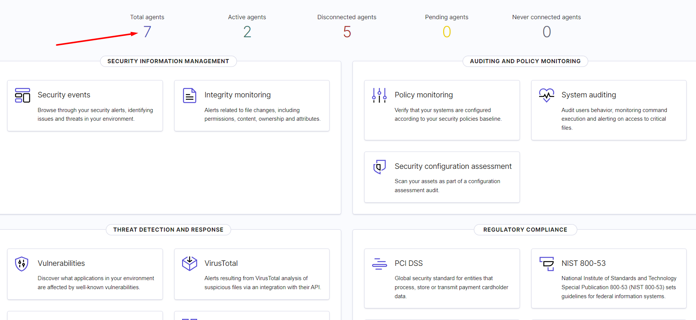
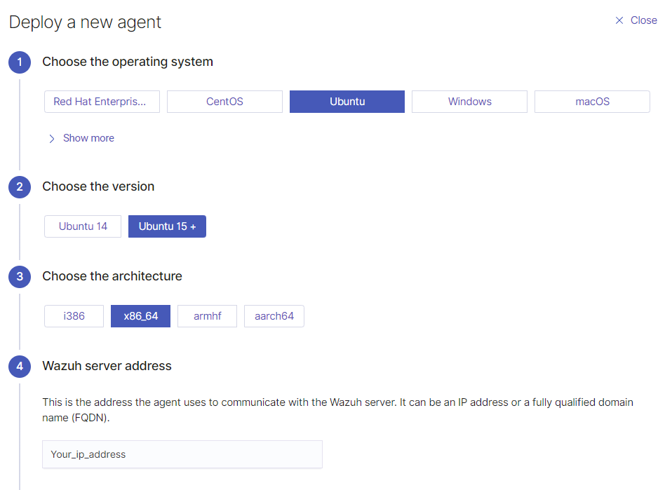
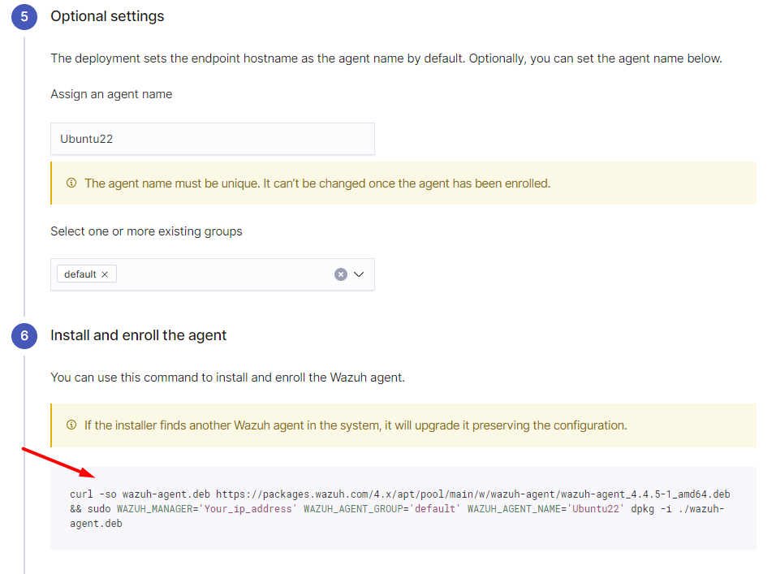

# Adding Agents

## Adding Agents

1. Navigate to the <mark style="color:red;">`https://your_ip_address`</mark> and then go to the <mark style="color:red;">**total agents**</mark> to <mark style="color:red;">**deploy new agent**</mark>, fill in the information regarding the agent and copy the command that is given in the end of the page.

<div>

<figure><figcaption><p>Fig 17. Step 1</p></figcaption></figure>

 

<figure><figcaption><p>Fig 18. Step 2</p></figcaption></figure>

 

<figure><figcaption><p>Fig 19. Step 3</p></figcaption></figure>

 

<figure><figcaption><p>Fig 20. Step 4</p></figcaption></figure>

</div>

2. To finalize the addition of the agents reload the services and start the service.

```bash
sudo systemctl daemon-reload
sudo systemctl enable wazuh-agent
sudo systemctl start wazuh-agent
```
