# Wazuh Configurations

## Slack Integration

### Slack Channel Creation

1. First navigate to the slack app and <mark style="color:red;">**create a channel**</mark> with the disered name and choose to be a <mark style="color:red;">**public**</mark> or a <mark style="color:red;">**private one**</mark>.

<div>

<figure>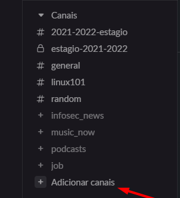<figcaption><p>Fig 1. Step 1</p></figcaption></figure>

 

<figure>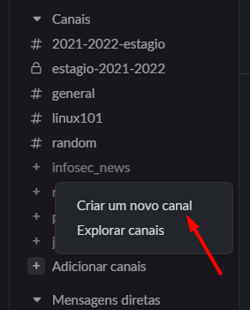<figcaption><p>Fig 2. Step 2</p></figcaption></figure>

 

<figure>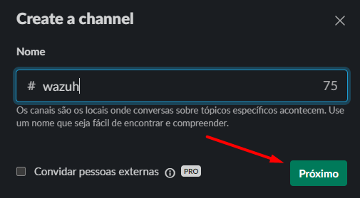<figcaption><p>Fig 3. Step 3</p></figcaption></figure>

 

<figure>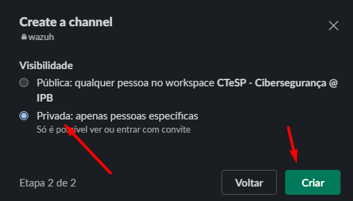<figcaption><p>Fig 4. Step 4</p></figcaption></figure>

</div>

2. Then navigate to [https://api.slack.com/apps](https://api.slack.com/apps).
3. After that, <mark style="color:red;">**Create a new App from scratch**</mark>.

<div>

<figure>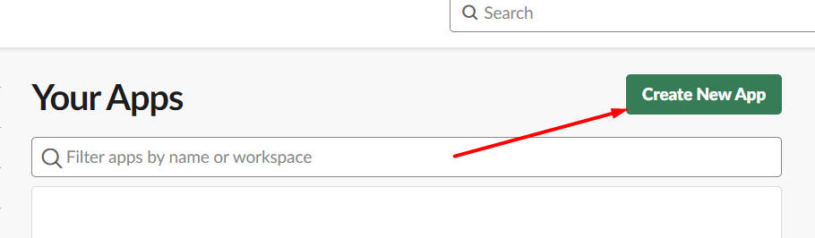<figcaption><p>Fig 5. Step 1</p></figcaption></figure>

 

<figure>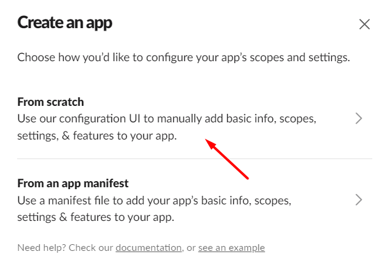<figcaption><p>Fig 6. Step 2</p></figcaption></figure>

</div>

4. After that configure the <mark style="color:red;">**App Name**</mark> and the <mark style="color:red;">**Workspace**</mark> that your channel belong.

<figure>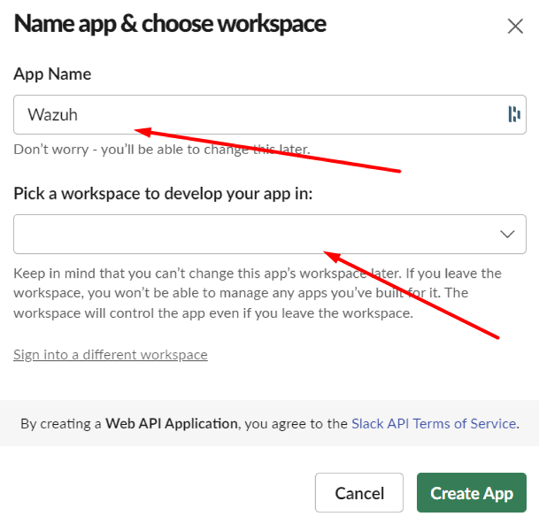<figcaption><p>Fig 7. Step 4</p></figcaption></figure>

5. Finaly configure the <mark style="color:red;">**Incoming Webhook**</mark> and copy the <mark style="color:red;">**Webhook URL**</mark>.

<div>

<figure>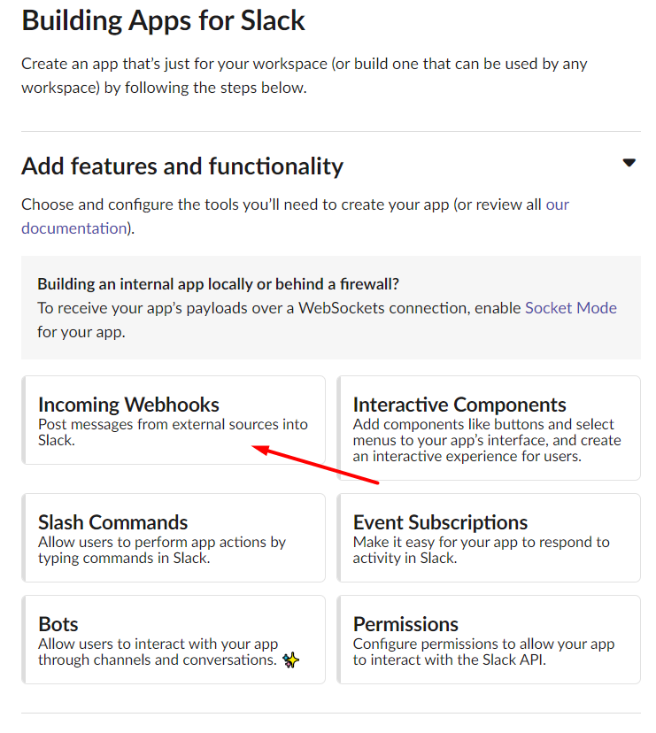<figcaption><p>Fig 8. Step 1</p></figcaption></figure>

 

<figure>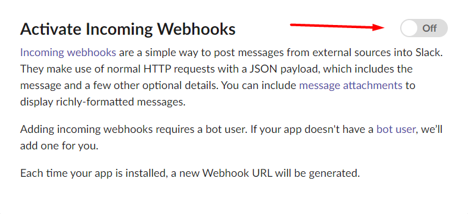<figcaption><p>Fig 9. Step 2</p></figcaption></figure>

 

<figure>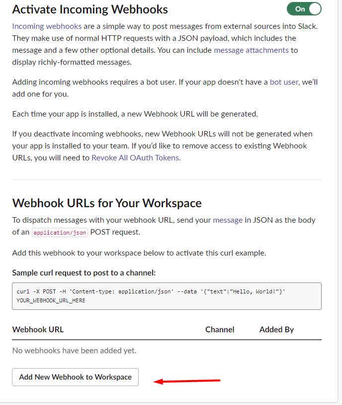<figcaption><p>Fig 10. Step 3</p></figcaption></figure>

 

<figure>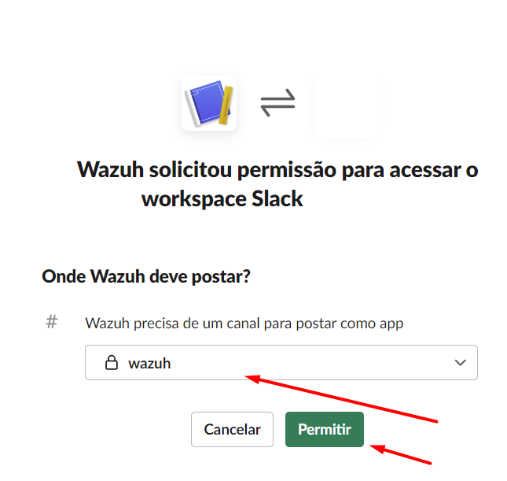<figcaption><p>Fig 11. Step 4</p></figcaption></figure>

</div>

<figure>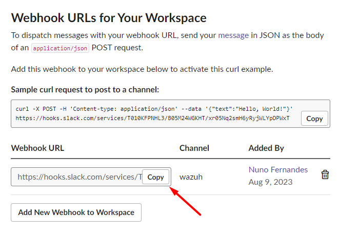<figcaption><p>Fig 12. Step 5</p></figcaption></figure>

### Wazuh Configuration File

1. Replace the <mark style="color:red;">`hook_url`</mark> from the URL copy in the step above.&#x20;
2. In this configuration I created two slack channels, one to recive the alerts of the <mark style="color:red;">`rules_id`</mark> <mark style="color:red;">**5503**</mark> and <mark style="color:red;">**5710**</mark>, and another channel to receive alerts from <mark style="color:red;">`level`</mark> <mark style="color:red;">**8**</mark> and above.

```xml
<integration>
    <name>slack</name>
    <hook_url>HOOK_URL_FROM_SLACK</hook_url>
    <alert_format>json</alert_format>
    <rule_id>5503,5710</rule_id>
</integration>

<integration>
    <name>slack</name>
    <hook_url>HOOK_URL_FROM_SLACK</hook_url>
    <alert_format>json</alert_format>
    <level>8</level>
</integration>
```

## VirusTotal Integration

### Slack Acount Creation

1. Go to the [https://www.virustotal.com/gui/home/upload](https://www.virustotal.com/gui/home/upload).
2. Click in the <mark style="color:red;">**Sign up**</mark> button.

<figure>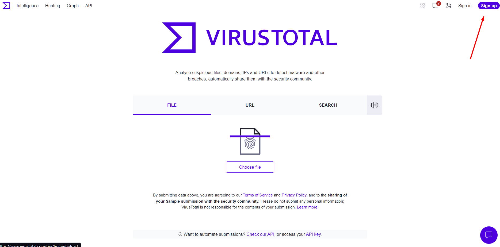<figcaption><p>Fig 13. Step 1 of VirusTotal acount creation</p></figcaption></figure>

3. Fill in the information needed or continue using Google, Twitter, Github or Microsoft.

<figure>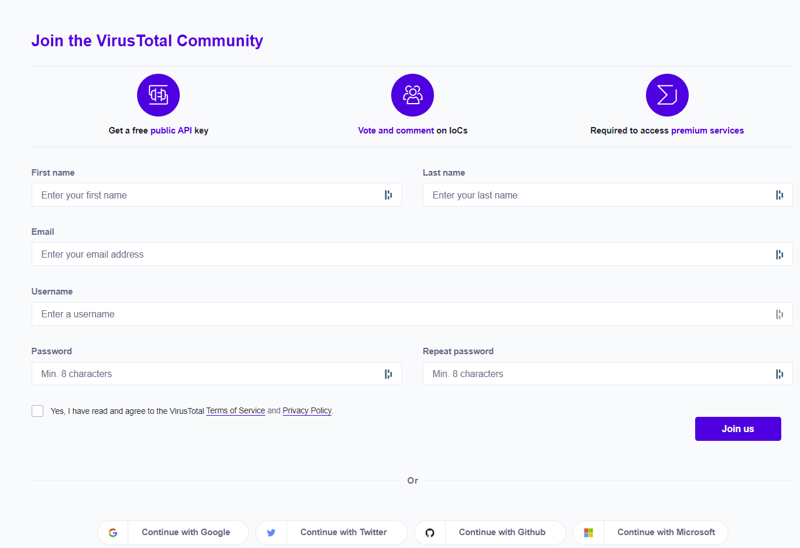<figcaption><p>Fig 14. Step 2 of VirusTotal acount creation</p></figcaption></figure>

4. After that navigate to the <mark style="color:red;">**API key**</mark> section.

<figure>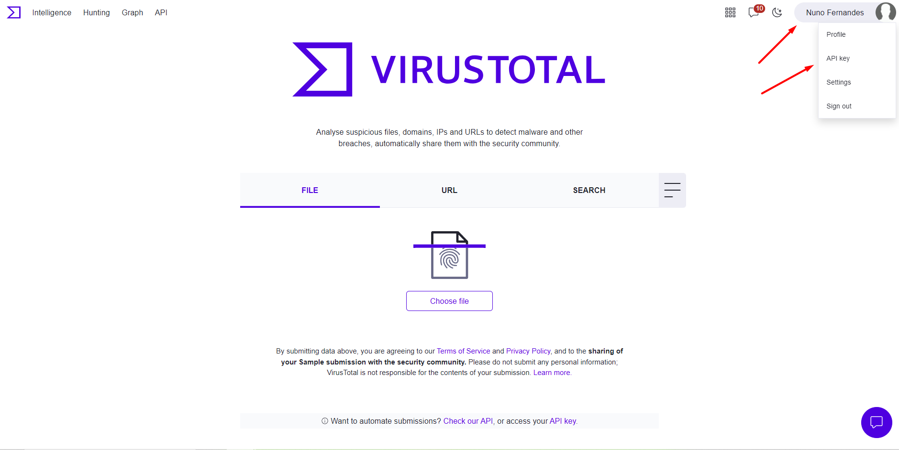<figcaption><p>Fig 15. Step 1 of getting the API key</p></figcaption></figure>

5. After that copy the <mark style="color:red;">**API key**</mark>.

<figure>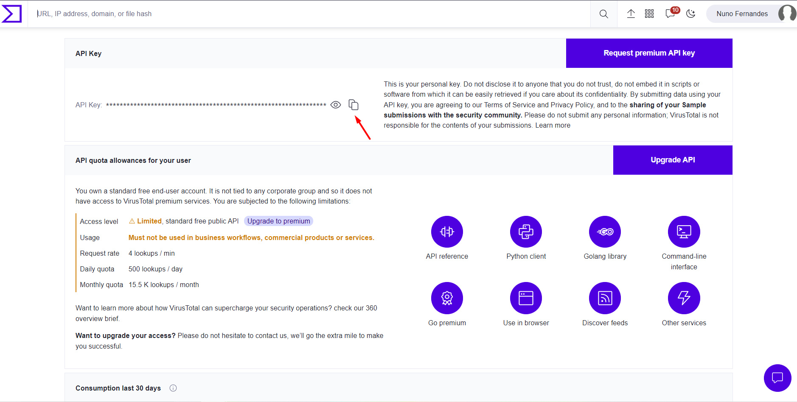<figcaption><p>Fig 16. Step 2 of getting the API key</p></figcaption></figure>

### Wazuh Configuration File

1. To use the <mark style="color:red;">**API key**</mark> from VirusTotal you need to copy the <mark style="color:red;">**API key**</mark> and change the <mark style="color:red;">`api_key`</mark> bellow.

```xml
<integration>
    <name>virustotal</name>
    <api_key>API_KEY</api_key> 
    <group>syscheck</group>
    <alert_format>json</alert_format>
</integration>
```

## Suricata Integration

1. You can install suricata following the documentation [https://documentation-com.gitbook.io/suricata-installation/](https://documentation-com.gitbook.io/suricata-installation/) and then add the following in the <mark style="color:red;">`/var/ossec/etc/ossec.conf`</mark> configuration file.

```
<localfile>
      <log_format>syslog</log_format>
  <location>/var/log/suricata/eve.json</location>
</localfile>
```

## Rootcheck Enabled

1. Bellow there is the configuration to enable <mark style="color:red;">**Rootcheck**</mark>.

```xml
<rootcheck>
    <disabled>yes</disabled>
    <check_files>yes</check_files>
    <check_trojans>yes</check_trojans>
    <check_dev>yes</check_dev>
    <check_sys>yes</check_sys>
    <check_pids>yes</check_pids>
    <check_ports>yes</check_ports>
    <check_if>yes</check_if>
    <frequency>21600</frequency>
    <skip_nfs>yes</skip_nfs>
</rootcheck>
```

## Vulnerability Detector Enabled

1. Bellow there is the configuration to enable the <mark style="color:red;">**Vulnerability Detector**</mark> and the <mark style="color:red;">`min_full_scan_interval`</mark>.&#x20;

```xml
<vulnerability-detector>
    <enabled>yes</enabled>
    <interval>5m</interval>
    <min_full_scan_interval>3h</min_full_scan_interval>
    <run_on_start>yes</run_on_start>
</vulnerability-detector>
```

## Syscheck Enabled

1. Bellow there is the configuration to enable <mark style="color:red;">**Syscheck**</mark> and the <mark style="color:red;">`frequency`</mark>.

```xml
<syscheck>
  <disabled>yes</disabled>
  <frequency>21600</frequency>
  <scan_on_start>yes</scan_on_start>
</syscheck>
```
